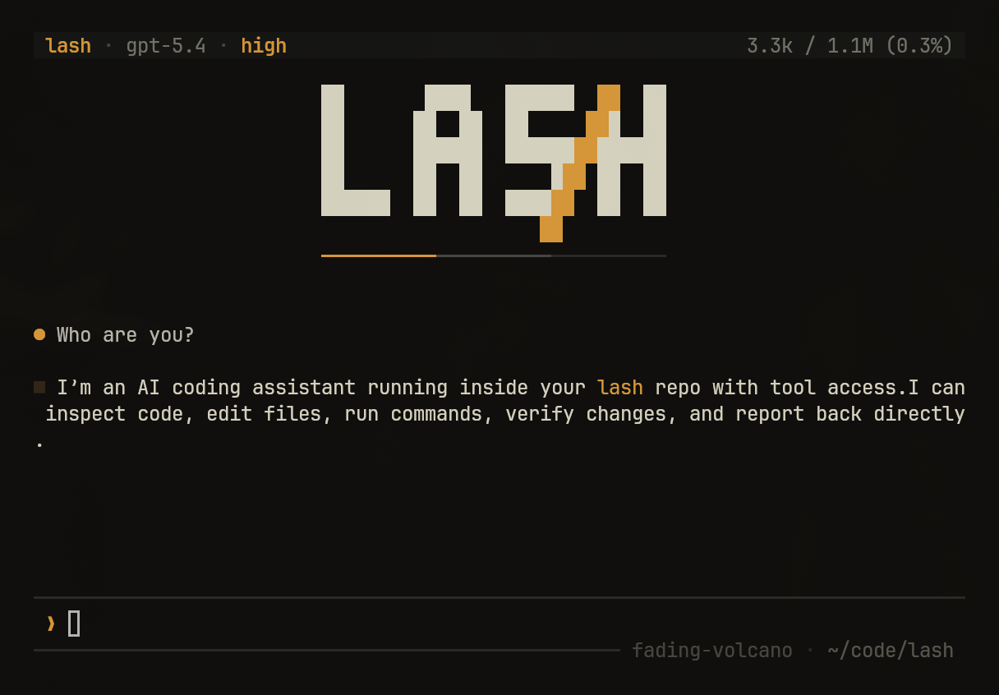

# lash

A Rust runtime for durable LLM agents.

Most agent stacks treat the LLM as the runtime and stitch state around it — a database for memory, a queue for retries, a sandbox for code. `lash` inverts that. The runtime is the durable end of the pair; the LLM is the variable call. Your app owns the outer boundaries — storage, auth, transport, product state. `lash` owns the turn — model calls, modes, tools, plugins, semantic stream events, usage, and terminal outcomes.

**Docs:** <https://lash.run/> — quickstart, embedding guide, tools, plugins, persistence, durable-workflow integration, and architecture chapters.

> **Alpha:** works today, API still moving fast — pin to an exact `=0.1.0-alpha.N` version when you embed.

## What's inside

- **Durable per-turn commits** — every completed turn lands as one atomic `RuntimeCommit` against a `SessionGraph`. Effects are the replay boundary; turns are the semantic commit boundary. → [persistence](https://lash.run/persistence.html)
- **Workflow-host integration** — a sans-IO turn machine behind one `EffectHost` boundary. The default `InlineEffectHost` runs in-process; the first-party Restate adapter replays effects from host history, exposes invocation identity for host cancellation and inspection, and retries the final idempotent commit. → [durability](https://lash.run/architecture/durability.html)
- **Two execution modes, one commit unit** — `standard` uses native provider tool-calling with concurrent dispatch; `rlm` runs `lashlang` programs in a sandboxed VM where every effect crosses the host. → [RLM](https://lash.run/rlm.html)
- **Tool providers and plugins** — ordinary host operations are `ToolProvider`s; plugins add runtime/session behavior such as prompts, planning, memory, subagents, history transforms, UI activity, catalog policy, and tool-output budgeting. Hosts compose only what they embed. → [tools](https://lash.run/tools.html), [plugins](https://lash.run/plugins.html)
- **Provider portability** — Anthropic, OpenAI Responses, any OpenAI-compatible Chat Completions endpoint, OpenAI Codex, and Google Gemini / Code Assist. MCP servers attach through `lash-plugin-mcp`. → [providers](https://lash.run/architecture/providers.html)
- **Tracing as a first-class sink** — attach a `TraceSink` for structured turn, tool, LLM, prompt, and usage records. Bundled JSONL sink + self-contained HTML viewer; optional OpenTelemetry export. → [tracing](https://lash.run/tracing.html)

## Embed it

`lash` ships on crates.io as `lash-runtime` (the bare name is taken), but is still imported as `lash`. During the alpha the dep needs the explicit pre-release tag:

```toml
[dependencies]
lash-runtime         = "=0.1.0-alpha.63"
lash-provider-openai = "=0.1.0-alpha.63"
anyhow               = "1"
tokio                = { version = "1", features = ["full"] }
```

```rust
use std::sync::Arc;

use lash::{LashCore, ModelSpec, TurnInput, provider::ProviderHandle};
use lash_provider_openai::{OPENROUTER_BASE_URL, OpenAiCompatibleProvider};

#[tokio::main]
async fn main() -> anyhow::Result<()> {
    let api_key = std::env::var("OPENROUTER_API_KEY")?;
    let provider = ProviderHandle::new(
        OpenAiCompatibleProvider::new(api_key, OPENROUTER_BASE_URL).into_components(),
    );

    let model = ModelSpec::from_token_limits("anthropic/claude-sonnet-4.6", None, 200_000, None)
        .map_err(anyhow::Error::msg)?;

    // one LashCore per app, cloned freely.
    let core = lash::StandardCore::builder()
        .provider(provider)
        .model(model)
        .effect_host(Arc::new(lash::durability::InlineEffectHost::default()))
        .attachment_store(Arc::new(lash::persistence::InMemoryAttachmentStore::new()))
        .build()?;

    // one session per chat / task; run one turn; read settled prose.
    let session = core.session("hello-1").open().await?;
    let result = session
        .turn(TurnInput::text("Say hi in one short sentence."))
        .run()
        .await?;

    println!("{}", result.assistant_message().unwrap_or_default());
    Ok(())
}
```

Full walkthrough in the [quickstart](https://lash.run/quickstart.html); the complete facade API — session specs, plugin stacks, turn streaming, persistence, subagents, MCP, durable workflows — is in the [embedding guide](https://lash.run/embedding.html). To wrap Lash behind a service boundary (HTTP, queues, workflow handlers), use the canonical DTOs from `lash::remote` — see [remote protocol](https://lash.run/remote-protocol.html).

## Examples

Two runnable apps under `examples/` drive the facade end-to-end — full hosts with a browser UI, real persistence, and optional durable execution. The docs walk through both at <https://lash.run/examples.html>.

```bash
# SQLite-backed chat app: RLM, app-owned tools, streaming, optional Restate turns
OPENROUTER_API_KEY=sk-or-... cargo run -p agent-service        # then open http://127.0.0.1:3000

# Adds durable background work: Lashlang processes, subagents, cron triggers (Restate required)
OPENROUTER_API_KEY=sk-or-... just agent-workbench 3000         # then open http://127.0.0.1:3000
```

See each example's README for environment knobs and Restate recipes.

## The CLI

`lash-cli` is a first-party terminal frontend on top of the library — patch-based editing, shell execution, file/web search, planning, subagents, session resume, live token accounting. Not the product, but a fully featured way to drive the runtime and a useful end-to-end reference.



```bash
curl -fsSL https://github.com/SamGalanakis/lash/releases/latest/download/install_lash.sh | bash
# or: cargo build -p lash-cli --release

lash                           # interactive TUI
lash -p "summarize this repo"  # single-shot to stdout
```

CLI reference: <https://lash.run/cli.html>.

## Contributing

Feature requests and bug reports welcome — open an [issue](https://github.com/SamGalanakis/lash/issues). At this alpha stage detailed write-ups (what you tried, expected, and saw) help more than drive-by PRs — see [CONTRIBUTING.md](CONTRIBUTING.md).

## License

MIT
