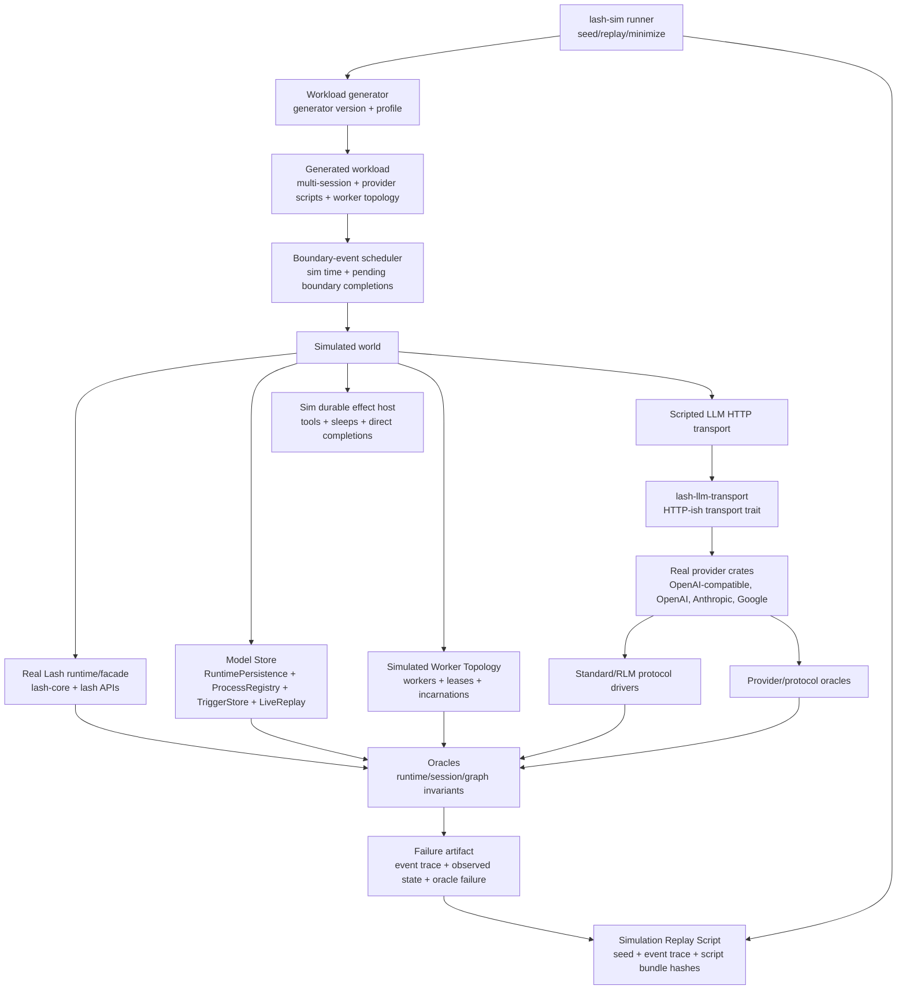

# Deterministic Simulation Harness Plan

## Status

Planning target for Lash's Deterministic Simulation Harness. This document
states the true wholehog DST end-state first; phase gates and v1 slices are
only the path toward that end-state, not the target itself.

Current executable evidence in the implementation:

- OpenAI-compatible, direct OpenAI Responses, Anthropic, and Google Provider
  Wire Scripts run through real provider crates via the production
  `LlmHttpTransport` seam and are included in the canonical provider matrix;
  Codex/OAuth/auth-flow exclusions are manifest-reviewed instead of accidental.
- Selected generated traces replay through real Lash SQLite session
  persistence via `SqliteSessionStoreFactory`, with durable peer stores and
  reopened-session evidence in the replay report.
- Full-lane Postgres trace replay is implemented as `lash-sim replay-postgres
  <trace> --out <artifact-root>`, gated by `LASH_POSTGRES_DATABASE_URL` or the
  confidence gate's Docker bootstrap, and writes replay/divergence artifacts.
- Generated traces are produced by `lash-sim.generated-workload.v8`, a
  deterministic state-machine generator over sessions, provider scripts,
  queued ingress, cancellation, triggers, observer reconnects, backend
  failure choices, provider mutations, tools, exec-code, durable effects,
  process wakes, worker lease/failover, retries, and duplicates.
- Generated traces include scheduler/completion evidence, a named
  `sim.oracle.operational-coverage.v1` oracle for the operational case set,
  and scenario contract oracles for Runtime, Standard, RLM, and Agent coverage
  without importing scenario test modules. Combined with the interleaved live
  turns, suspend/resume, live failure-turn, invariant floor, and real worker
  failover described under "Implemented DST substance", this is now true DST and
  not only operation-level conformance/replay.
- Runtime, Standard, RLM, and Agent scenario contract metadata is now exported
  from production/test-independent modules and serialized into `lash-sim`
  summaries alongside the generated oracle verdicts.
- Each exported Runtime, Standard, RLM, and Agent scenario contract must also
  have a generated trace-slice artifact under
  `scenario-contract-slices/<suite>/<test>.json`; the slice ties the contract's
  semantic oracle to concrete generated boundary events, a contract-specific
  generated transition shape, required evidence assertions, a family negative
  fixture, and matching verdicts.
- Generated summaries include explicit model-only boundary reviews for the
  remaining partially modeled durable-effect, worker, backend-failure,
  provider-mutation, tool, exec-code, and process-wake boundaries, each with a
  named oracle and artifact evidence.
- Provider manifests include reviewed non-DST exclusions for remaining
  Codex/OAuth/direct provider paths so direct reqwest/OAuth seams are named
  instead of accidental.
- `lash-sim minimize <trace>` writes a minimized package containing the
  minimized trace, replay verdict, oracle verdict, final summary, and package
  manifest; minimization preserves the failing oracle id and semantic reason
  when the input is a failure. Failing negative fixtures live under
  `crates/lash-sim/failure-fixtures/`.
- The confidence gate declares sim lane artifacts under
  `target/confidence/<lane>/sim/`, including env-gated Postgres conformance
  evidence when the lane is enabled.

Implemented DST substance (each item below is landed and gated by
`cargo test -p lash-sim`):

- The scheduler actually interleaves work: provider turns are spawned as live
  futures whose scripted-transport SSE chunks are released by scheduler-delivered
  `ProviderEvent` boundaries in seeded order, and the generated lane asserts a
  peak of at least two concurrent live turns
  (`sim.oracle.provider-turn-interleaving-depth`).
- Tool, durable-effect, and exec-code coverage pass through real turns that
  SUSPEND and RESUME: a generated suspend session runs a real
  `session.turn().run()` over the real `ScriptedLlmHttpTransport`, parks on a
  tool/durable/exec await key, and is resumed only by a scheduler-delivered
  completion boundary (`sim.oracle.generated-suspend-resume`). Both the
  tool-call exchange that suspends the turn and the post-resume exchange exercise
  real provider wire parsing.
- A non-retryable provider FAILURE is driven through a LIVE turn: a malformed
  mid-stream SSE chunk is delivered to a parked turn via the scripted-transport
  gating, and `sim.oracle.live-provider-failure-terminalizes` asserts the turn
  terminalizes with a terminal failure and commits no provider output (no leaked
  partial assistant prose, no Final Value).
- The invariant floor is enforced: graph acyclicity, exactly one active Agent
  Frame, monotonic usage accounting, and Final Value as a semantic outcome
  distinct from transcript/prose, each as a named failing-capable oracle and
  re-verified from recorded facts on replay. The Runtime suite proves each
  contract with distinct per-contract evidence; the Standard/RLM/Agent protocol
  suites — not distinctly exercised per-contract by the generic generated
  workload — are honestly collapsed to one failing-capable suite-level coverage
  manifest each (plus the real per-behavior mini-oracles), so the oracle count
  no longer overstates per-contract assurance.
- One real discovered regression is minimized and promoted: the
  `queued-active-turn-cancel-race` fixture under `crates/lash-sim/replays/` is a
  deterministic regression guard, and the broad/full lane additionally surfaced
  an open cross-backend SQLite divergence promoted as
  `cross-backend-sqlite-active-turn-divergence` (see Known limitations).
- Generator substance is real: the fast profile is genuinely seed-random,
  provider mutations have distinct executable behaviors, queued-ingress mode
  varies, and worker failover is generated as REAL failover — a second worker
  incarnation reclaims the crashed owner's session-execution lease at a strictly
  higher fencing token and CONTINUES the queued work the dead owner could not,
  rejecting its stale completion (`sim.oracle.worker-failover-continues-work`).
  The abstract model no longer fabricates worker fencing: it carries the real
  reclaim/fence facts produced by the live lease store, re-verified by the
  SQLite/Postgres backend replays.

Known limitations (documented, not silently skipped):

- The open cross-backend SQLite divergence remains the canonical UN-minimized
  repro. It is scale-dependent (it does not reproduce at lib/fast-random scale),
  so the model-replay minimizer — which preserves only abstract-model behavior —
  does not preserve it, and a divergence-preserving shrink would have to re-run
  the serial SQLite replay per candidate, which DEADLOCKS at the unbounded
  active-turn enqueue (`sqlite_replay::queue_turn_input`). Bounding that enqueue
  deterministically would require a clock the sim forbids or the product fix that
  is intentionally out of scope. The quarantine is therefore SELF-CHECKING: the
  lane runs the known divergence under a bounded deterministic yield budget and
  asserts it still reproduces (a divergence error or the deadlock signature),
  failing loudly if it ever completes cleanly so a silent product fix cannot go
  undetected.

## Related Documents

- `CONTEXT.md` defines the canonical terms: Deterministic Simulation Harness,
  Provider Wire Script, Simulation Replay Script, and Simulated Worker
  Topology. This plan preserves those terms and does not add implementation
  details to the glossary.
- `docs/adr/0007-four-layer-scenario-harnesses.md` defines the existing
  Runtime Scenario, Standard Protocol Scenario, RLM Protocol Scenario, and
  Agent Scenario ownership model. The sim composes those contracts; it does not
  create a fifth scenario family.
- `docs/adr/0008-confidence-gate.md` defines `scripts/confidence-gate.sh` as
  Lash's single executable confidence contract. Simulation lanes extend that
  gate instead of adding a second gate.
- `docs/adr/0009-deterministic-simulation-harness.md` records the combined
  architectural decision for this harness.

## Goal

Build a replayable generated execution mode that drives real Lash runtime,
protocol, provider, tool, process, and persistence contracts inside a
deterministic simulated world. In the done state, the harness should find
schedule, failure, provider-streaming, lease, replay, and backend-ordering bugs
that example-based tests miss, while every failure is reproducible from a seed,
generator version, and event trace and can later be minimized into a Simulation
Replay Script. The bug-finding claim is now backed by current evidence: the
broad/full lane surfaced a real cross-backend SQLite divergence that the
example/lib-scale tests do not catch, promoted as the
`cross-backend-sqlite-active-turn-divergence` fixture and guarded by a
self-checking quarantine. (It remains the canonical un-minimized repro for the
reason given under "Known limitations".)

The highest-value property is not "more random tests". It is one deterministic
world that can compose the contracts Lash already owns:

- Runtime Scenarios.
- Standard Protocol Scenarios.
- RLM Protocol Scenarios.
- Agent Scenarios.
- LLM provider normalization and wire parsing conformance.
- Runtime/persistence/backend conformance.
- The Durable Fault Matrix.

## Full Endstate: Optimal Lash DST

The optimal end-state is a deterministic simulation testing system for Lash,
not a collection of example tests, mock providers, or narrow fixtures. It is a
single generated world that can repeatedly attack Lash's owned state machines,
durability boundaries, provider boundaries, and persistence contracts under
seeded schedules and faults, then produce a replayable artifact when anything
violates the contract.

In the done state, a developer should be able to run one confidence command and
trust the result because the command has exercised the important contract space
directly:

```sh
scripts/confidence-gate.sh full
```

That gate is not "proof that all code paths were covered". It is evidence that
Lash's declared contracts survived deterministic generated workloads,
boundary-event schedule variation, fault injection, model checking, backend
replay, provider wire mutation, and regression replay.

The done-line is intentionally higher than a deterministic conformance/replay
harness. A true Lash DST must satisfy all of these criteria:

- Scheduler interleaving is real: at least two sessions' turns are live at the
  same time, and `BoundaryScheduler` chooses among scripted-transport provider
  chunks and turn completions in seeded order.
- Tools and durable effects run through real turns: a generated/scripted turn
  calls a tool or awaits a durable effect, the scheduler delivers the result,
  and the trace proves suspend-to-resume semantics.
- The invariant floor is executable: graph acyclicity, exactly one active Agent
  Frame, monotonic usage accounting, and Final Value as a semantic outcome
  distinct from transcript/prose all have named oracle verdicts.
- Scenario-contract oracles are per-contract: each Runtime, Standard, RLM, and
  Agent contract has distinct evidence/semantics or an actual named scenario
  run, not a generic coverage bucket.
- At least one real discovered regression has been minimized, replayed, and
  promoted under `crates/lash-sim/replays/` before the docs or summaries claim
  the harness finds bugs example tests miss.
- The generator exercises the state space it names: fast profiles are genuinely
  random, provider mutations differ semantically, queued-ingress modes vary,
  and worker failover is generated as failover.

### Endstate Invariants

The DST owns invariant checks over the observable Lash model. These invariants
are executable oracles, not prose expectations:

- Session, turn, graph, and transcript invariants: every turn has a single
  coherent lifecycle; final output is emitted once; progress and final values
  are not duplicated; the session graph is acyclic; graph edges reference
  existing nodes; every session has exactly one active Agent Frame; observer
  replay and live updates converge on the same state.
- Process invariants: process runs have one owner at a time; lease transitions
  are monotonic; stale completions from prior owners/incarnations are rejected;
  process output and completion state are replay-stable.
- Queued ingress invariants: pending user input, active-turn input,
  next-turn input, cancellation, trigger delivery, and duplicate source keys
  each occupy one explicit state; no input is lost, double-claimed, or later
  redriven after cancellation.
- Durable effect invariants: sleeps, direct completions, tool calls,
  exec-code results, and replayed effects execute exactly once per durable key
  and resume with the same semantic result after crash/restart.
- Protocol invariants: Standard, RLM, and Agent Scenario contracts remain
  authoritative and are plugged into the sim through narrow reusable oracles.
  The sim never forks a fifth scenario taxonomy.
- Provider invariants: provider request serialization, response parsing,
  streaming fragmentation, non-2xx envelopes, retryability, cancellation,
  timeout handling, and usage/terminal-reason normalization all run through
  real provider crates and the production transport seam; token and provider
  usage are monotonic where streams report incremental usage.
- Semantic outcome invariants: Final Value is an app/protocol result distinct
  from transcript text, assistant prose, and raw provider chunks. A transcript
  can be correct while the Final Value is wrong, and the oracle must catch that.
- Persistence invariants: the high-volume model store, SQLite replay, and
  Postgres replay agree on observable Lash state for selected and minimized
  traces; any divergence is a first-class failure artifact.

### Endstate Simulation World

The simulator controls boundary completions, not arbitrary future polls. Tokio
still schedules Rust futures, while `lash-sim` decides when externally visible
events become available.

The generated world includes:

- Multi-session workloads with genuinely concurrent turns, queued input,
  active-turn steering, cancellation, process wakes, triggers, observer
  reconnects, and selected facade replays.
- Boundary scheduling that chooses among provider response starts, chunks,
  stream ends, tool results, durable-effect completions, and final turn
  completions from at least two live sessions in seeded order.
- Provider Wire Scripts for every migrated provider path: OpenAI-compatible,
  direct OpenAI, Anthropic, Google, and any later Codex/OAuth phase that is
  deliberately brought under this contract.
- Tool and durable-effect scripts that cover success, failure, delayed
  completion, cancellation, replay, duplicate completion, and timeout through
  real turn execution, not isolated effect helper calls.
- A Simulated Worker Topology with worker identities, lease owners,
  incarnations, crash/restart, failover, stale completions, and cross-worker
  contention, all modeled in one process.
- Backend variation with a fast model store for randomized search, SQLite for
  selected/default replay, and Postgres for full/nightly replay.
- Fault injection across provider disconnects, malformed chunks, retryable and
  non-retryable errors, transport timeouts, duplicate inputs, worker loss,
  lease expiry, stale writes, observer gaps, backend failures that real
  backends can return, and durable-effect replay.
- Generated workload families that are added only after a named oracle exists
  for the contract being attacked.

The simulator explicitly does not need to model host kernel behavior, physical
network partitions, arbitrary filesystem corruption, Docker orchestration, or
Restate internals. Those remain covered by focused e2e or backend-specific
tests. The DST models Lash's own semantic boundary: the events Lash can observe
and the durable state Lash promises to preserve.

### Endstate Replay And Reduction

Every interesting or failing run produces a complete reproducibility package:

- seed, generator version, profile, shard, and workload family;
- script bundle hashes and canonical fixture hashes;
- stable aliases for dynamic runtime IDs;
- `events.jsonl` containing the delivered boundary sequence and observed
  outputs;
- model/store snapshots at oracle checkpoints;
- provider request/response transcripts with redaction;
- runtime/protocol/provider/persistence oracle verdicts;
- final abstract world summary;
- exact replay command.

`lash-sim replay <trace>` must reproduce the same terminal verdict, delivered
boundary sequence, oracle id, and abstract final summary. `lash-sim minimize
<trace>` must remove events, operations, chunks, workers, and provider scripts
only while preserving the same oracle class for the same semantic reason.
Accepted minimized traces become regression fixtures under
`crates/lash-sim/replays/` only after review confirms they came from a real
discovered regression or a deliberately named conformance regression. Generated
coverage packages and negative fixtures are not promoted bug discoveries by
themselves.

### Endstate Confidence Gate

The single confidence contract remains `scripts/confidence-gate.sh`; DST lanes
extend that contract instead of creating a second gate.

- `fast` proves the fixed replay corpus, provider wire corpus, tiny generated
  seed set, and basic oracle set with deterministic artifacts.
- `default` runs broader generated workloads, selected SQLite replay, and
  enough provider matrix coverage to catch normal PR regressions.
- `broad` runs a bounded full-profile generated workload, reviewed replay
  fixtures, backend-replayable generated packages, targeted mutation evidence,
  and SQLite/Postgres replay when available. It is broad current evidence, not
  a true full confidence claim.
- `full` runs long randomized workloads, full migrated-provider matrix,
  SQLite/Postgres replay, full mutation/property test lanes, and failure
  artifact verification. A green `full` lane means full mutation actually ran
  and the true DST done-line criteria above are being exercised.

The gate emits machine-readable summaries and reproduction commands under
`target/confidence/<lane>/sim/`. Bounded broad artifacts report
`confidence_class=bounded_broad`; they are comparable across current
implementation passes but are not labeled as full confidence. A green full lane
means: for the contracts encoded as oracles and generator families, Lash is
probably correct. Coverage reports remain useful as a map of blind spots, but
they are not the goal.

### Endstate Design Constraints

- Invalid states are made hard or impossible at production boundaries first;
  tests then attack the remaining valid state space.
- `lash-sim` is a separate unpublished workspace crate. Simulation-only types
  do not leak into public SDK surfaces.
- Provider crates own vendor schemas and parsing; the transport seam owns
  HTTP-ish execution and byte streams; `lash-sim` owns scripted execution.
- Shared oracles are extracted narrowly from owning crates. `lash-sim` does
  not import test modules directly.
- Generated random tests are deterministic by seed and generator version.
- Fault injection is semantic. It injects failures Lash can actually observe
  instead of inventing impossible backend/provider behavior.
- The model store is intentionally optimized for introspection and volume, but
  backend replay prevents it from becoming the only contract.
- A new workload family is not considered useful until it has an oracle strong
  enough to fail on the bug class it claims to cover.
- Intermediate fixtures, fixed scripts, and phase gates are disposable
  stepping stones unless they become regression artifacts or confidence-lane
  inputs.

## Scope

The v1 harness includes:

- An unpublished workspace crate, `lash-sim`, that owns generation, scheduling,
  replay, reduction hooks, sim traces, model-store simulation, and confidence
  lane entry points.
- A production-visible provider-agnostic HTTP-ish transport seam in
  `lash-llm-transport`, used by real LLM Provider crates in normal production
  paths and by simulated provider transport in `lash-sim`.
- Provider Wire Scripts that script provider-native HTTP/SSE responses without
  live LLM calls.
- Boundary-event scheduling: the sim controls completion of external
  boundaries such as provider chunks, tool returns, durable effects, clock
  sleeps, worker crashes, lease expiry/reclaim, trigger delivery, and observer
  reconnects. It does not implement a custom async executor and does not
  control every future poll.
- Multi-session generated workloads from the first workload slice.
- A bounded Simulated Worker Topology: worker identities, lease owners,
  incarnations, crash/restart/failover, and cross-worker lease contention, all
  modeled in one process.
- A high-volume model store for randomized search plus selected replay through
  SQLite and full/nightly replay through Postgres.
- First-class graph/session/runtime invariants with protocol, provider,
  persistence, and scenario oracles plugged in.
- Fast, default, and full confidence-gate lanes with deterministic budgets and
  artifacts.

## Non-Goals

- No fifth scenario taxonomy. The sim is an execution mode over existing
  scenario/conformance contracts.
- No live LLM calls. Provider Wire Scripts are scheduled by the sim and parsed
  by real provider crates.
- No primary mock provider path. Existing scripted/test providers can remain
  where they already own focused tests, but the simulation path exercises real
  provider request builders and response parsers through the transport seam.
- No custom async executor. Tokio still polls futures; the sim controls the
  externally visible boundary completions they await.
- No Docker, network partition, host kernel, container, or physical multi-host
  simulation in v1.
- No Restate-internals simulation. The sim models Lash's durable effect
  boundary and worker/lease semantics, not Restate workflow internals.
- No direct imports of test modules as the shared oracle mechanism. Shared
  oracles must be extracted narrowly behind `testing` APIs or support modules.
- No exhaustive replacement for e2e tests. Facade replay through `lash` APIs is
  selected and deliberate; dense simulation lives at the core/protocol level.

## Terminology

| Term | Meaning in this plan |
| --- | --- |
| Deterministic Simulation Harness | Generated execution mode that composes existing Lash contracts under deterministic schedules and faults. |
| Provider Wire Script | Provider-native HTTP/SSE fixture consumed by a simulated LLM Provider transport and parsed by real provider crates. |
| Simulation Replay Script | Reproducible event trace for a failed or interesting simulation run. Minimized scripts become regression fixtures. |
| Simulated Worker Topology | In-process model of worker identities, lease owners, incarnations, crashes, restarts, failover, and cross-worker contention. |
| Boundary Event | A scheduler-controlled external completion visible to Lash, such as a provider chunk, tool result, clock sleep, durable effect result, lease expiry, worker restart, trigger occurrence, queued work delivery, or observer reconnect. |
| Model Store | High-volume deterministic store implementation owned by `lash-sim`, instrumented for invariant checking and abstract-state comparison. |

## Target Architecture



### Component Responsibilities

| Component | Owner | Responsibility |
| --- | --- | --- |
| `lash-sim::runner` | `lash-sim` | CLI/test entry points, seed selection, profile budgets, replay, minimization commands, artifact paths. |
| `lash-sim::generator` | `lash-sim` | Versioned workload generation from canonical templates and seeded mutations. |
| `lash-sim::scheduler` | `lash-sim` | Deterministic boundary-event queue, simulated time, pending completion selection, trace emission. |
| `lash-sim::provider` | `lash-sim` | Provider Wire Script registry, request matching, scheduled response chunks, transport failures, script mutation. |
| `lash-sim::runtime_boundaries` | `lash-sim` | Scripted local runtime-effect host for provider/tool/exec/durable-effect/process-wake boundaries and replay-by-key checks. |
| `lash-sim::runtime_providers` | `lash-sim` | No-live provider execution through migrated provider crates and scripted transports. |
| `lash-sim::provider_mutations` | `lash-sim` | Provider parser/failure mutation matrices, including retryable and terminal parser/error paths. |
| `lash-sim::store` | `lash-sim` | Model store, abstract-state snapshots, worker/lease topology state, instrumentation, and replay summaries. |
| `lash-sim::sqlite_replay` / `postgres_replay` | `lash-sim` | Backend replay through production-facing SQLite/Postgres persistence and native Postgres runtime effect history. |
| `lash-sim::backend_contention` | `lash-sim` | Production-backed lease contention, stale completion fencing, reopen, and dead-owner reclaim evidence. |
| `lash-sim::oracles` | `lash-sim` plus testing APIs from existing crates | Invariant engine and adapters for runtime/protocol/provider/persistence contracts. |
| `lash-llm-transport` | production crate | Provider-agnostic HTTP request/response/stream trait, reqwest implementation, timeout/body helpers, SSE framing helpers. |
| Provider crates | production crates | Vendor request serialization, auth headers, response parsing, normalization, and error classification. They use the transport seam but do not contain simulation logic. |

## Crate And Module Plan

### New Crate: `crates/lash-sim`

`lash-sim` is a workspace member but is unpublished:

- `publish = false`.
- Not in `default-members`.
- Built and run only by tests, `cargo run -p lash-sim`, and confidence lanes.
- Owns sim-only types and artifacts. It must not leak simulation-only APIs into
  public `lash` or provider crate surfaces.

Suggested modules:

| Module | Contents |
| --- | --- |
| `runner` | `run_seed`, `run_profile`, replay package generation, command-line entry support, artifact layout. |
| `generator` | Versioned RNG, profiles, operation generators, canonical scenario seed import, mutation controls. |
| `scheduler` | Boundary event types, pending handles, deterministic tie-breaking, sim clock, delivery trace. |
| `provider` | Provider Wire Script parser, matcher, canonical script library, chunk/timing/fault mutation. |
| `provider_mutations` | Provider parser/fault mutation matrices for no-live provider crates. |
| `runtime_boundaries` | Local scripted runtime-effect host, effect replay store, and boundary execution checks. |
| `runtime_providers` | Runtime provider-turn construction through migrated provider crates and scripted transports. |
| `store` | Model store, abstract-state model, store event log, worker/lease topology, backend replayable regression metadata. |
| `sqlite_replay` / `postgres_replay` | Trace replay through production persistence APIs and backend-specific effect history. |
| `backend_contention` | SQLite/Postgres contention and fencing conformance scenarios. |
| `minimize` | Simulation Replay Script minimization and failing fixture preservation. |
| `oracles` | Runtime/session/graph invariants plus adapters to protocol/provider/persistence/scenario oracles. |
| `trace` | Event trace schema, stable aliasing for runtime IDs, redaction, hash computation. |
| `replay` | Simulation Replay Script loader, deterministic rerun, minimized fixture generation. |

### Existing Crate Changes

| Crate | Required change |
| --- | --- |
| `lash-llm-transport` | Add the production-visible HTTP-ish transport seam and default reqwest transport. Move response/body streaming helpers away from concrete `reqwest::Response` where necessary. |
| `lash-provider-openai` | First provider migration. OpenAI-compatible Chat Completions uses the new transport seam first, then direct OpenAI Responses follows. Existing request builders and parsers stay provider-owned. |
| `lash-provider-anthropic` | Migrate after OpenAI-compatible and direct OpenAI are stable. Preserve Anthropic-specific beta/header/request logic inside the provider crate. |
| `lash-provider-google` | Migrate provider request execution and upload/project-resolution calls deliberately. OAuth/device flows can remain outside v1 provider simulation unless a workload explicitly targets them. |
| `lash-core` | Expose narrow testing oracles/specs for runtime invariants and scenario metadata. Do not expose sim implementation types. |
| `lash-protocol-standard` | Expose narrow testing oracle/spec adapters for Standard Protocol Scenario contracts. |
| `lash-protocol-rlm` | Expose narrow testing oracle/spec adapters for RLM Protocol Scenario contracts. |
| `lash` | Expose narrow agent scenario/graph contract helpers behind `testing` where facade replay needs them. |
| `scripts/confidence-gate.sh` | Add sim lane commands and artifact directories inside the existing `fast`, `default`, and `full` contract. |

## Provider Transport Design

### End-State Shape

`lash-llm-transport` should own a provider-agnostic transport abstraction that
is production-visible:

```rust
#[async_trait::async_trait]
pub trait LlmHttpTransport: Send + Sync + std::fmt::Debug {
    async fn send(
        &self,
        request: LlmHttpRequest,
        timeout: Option<std::time::Duration>,
    ) -> Result<LlmHttpResponse, lash_core::LlmTransportError>;
}

pub struct LlmHttpRequest {
    pub method: LlmHttpMethod,
    pub url: String,
    pub headers: Vec<(String, String)>,
    pub body: bytes::Bytes,
    pub body_for_error: Option<String>,
}

pub struct LlmHttpResponse {
    pub status: u16,
    pub headers: Vec<(String, String)>,
    pub body: LlmHttpBody,
}

pub enum LlmHttpBody {
    Buffered(bytes::Bytes),
    Streamed(Box<dyn LlmByteStream>),
}
```

The exact Rust shape can differ, but these constraints are non-negotiable:

- Provider crates do not depend on `reqwest::Response` for parsing.
- The default production path is a `ReqwestLlmHttpTransport`.
- Simulated provider execution is a `ScriptedLlmHttpTransport` in `lash-sim`.
- The seam supports both buffered JSON and streaming SSE.
- Transport failures carry status, headers, raw body, retryability hints, and
  request-body snapshots in the same normalized error envelope providers use
  today.
- Provider crates continue to own request serialization, vendor headers,
  endpoint paths, response parsing, terminal reason mapping, and usage mapping.
- The seam is not `#[cfg(test)]` and not a hidden test double.

### Transport Seam Contract Checklist

Every provider migration must satisfy this checklist before a later sim phase
may depend on it:

| Contract | Requirement | First proof |
| --- | --- | --- |
| Buffered responses | `LlmHttpBody::Buffered` preserves status, headers, raw bytes, and body read timeout behavior without requiring `reqwest::Response` downstream. | Unit test in `lash-llm-transport`; OpenAI-compatible non-streaming provider conformance still passes. |
| Streaming responses | `LlmHttpBody::Streamed` yields deterministic byte chunks, supports partial UTF-8/SSE frames, flushes terminal buffered events, and reports mid-stream disconnects. | Existing SSE split tests ported to transport-agnostic stream plus one Provider Wire Script with split tool-call arguments. |
| Error envelopes | Non-2xx responses preserve status, multi-value headers, raw body, extracted provider detail, and request-body snapshot in `LlmTransportError`. | Provider error script for rate-limit and validation errors; classifier tests assert retryable/non-retryable mapping. |
| Timeouts | Response-start timeout and chunk/read timeout remain separately configurable and keep current retryable timeout codes. | Transport unit tests for response-start timeout and stream chunk timeout. |
| Cancellation | Dropping or cancelling a provider call stops scripted stream delivery and aborts the reqwest request future without reporting a successful partial response. | Sim test cancels an active turn during an in-flight provider stream and asserts no committed provider output. |
| Headers | Requests and responses preserve repeated headers and case-insensitive lookup; request matchers can assert either exact multi-value headers or semantic header predicates. | Transport test with duplicate `set-cookie`/retry headers and Provider Wire Script matcher over `authorization`/`content-type`. |
| Request-body snapshot | Body bytes are captured once, shared by the real transport and scripted transport, and attached to provider failures without reserializing provider JSON. | OpenAI-compatible error path asserts the emitted failure body equals the bytes sent through the transport. |
| Retryability | Transport failures report enough kind/status/header data for `ProviderFailureClassifier` and `ProviderHandle` retry policy to behave exactly as before. | Retry exhaustion test runs through migrated OpenAI-compatible transport and still emits retry status events. |
| Compatibility | Clean end-state replaces provider `with_client` with `with_transport`. If public compatibility blocks removal, `with_client` is only a wrapper around `ReqwestLlmHttpTransport::from_client`; it cannot be the provider's stored execution seam. | API review in the first provider PR; tests construct both default transport and explicit scripted transport. |

### Migration From Current Provider Shape

Current provider crates accept or construct `reqwest::Client` and use
`lash-llm-transport` helpers such as `send_request`, `read_response_text`, and
`drive_sse_response` over concrete `reqwest` types. The clean end-state is:

1. Add `LlmHttpTransport` and `ReqwestLlmHttpTransport` to `lash-llm-transport`.
2. Convert `drive_sse_response` to consume provider-agnostic byte streams, not
   `reqwest::Response`.
3. Replace provider `client: reqwest::Client` fields with
   `transport: Arc<dyn LlmHttpTransport>`.
4. Replace public `with_client` construction with `with_transport` for the
   alpha clean cutover. If a compatibility promise later blocks removing
   `with_client`, keep it only as a thin production wrapper over
   `ReqwestLlmHttpTransport::from_client`, and document that as a compatibility
   exception.
5. Port OpenAI-compatible Chat Completions first because existing end-to-end
   mock behavior is OpenAI-compatible and the request/response surface is the
   smallest useful vertical slice.
6. Port direct OpenAI Responses, Anthropic, and Google in separate PRs.
7. Keep provider conformance strict after each provider migration.

### Codex OAuth Transport Boundary

The current provider-transport simulation lane explicitly excludes
`CodexProvider` transport migration and records that exclusion in the
`provider_transport_exclusions` manifest field. Codex uses ChatGPT OAuth
credentials, a WebSocket-first execution path with SSE fallback,
continuation-cache behavior,
Codex-specific headers, and OAuth/device-flow lifecycle concerns. Migrating
only the SSE fallback to `LlmHttpTransport` would leave the primary WebSocket
path outside the seam and create a partial simulation contract for a provider
whose boundary is broader than provider-native HTTP/SSE parsing.

Codex belongs to a later Codex/OAuth transport phase that migrates or models
the whole Codex execution boundary deliberately, including WebSocket behavior
and OAuth-owned request headers. Until that phase, the deterministic provider
simulation contract is OpenAI-compatible Chat Completions, direct OpenAI
Responses, Anthropic Messages, and Google generateContent scripts flowing
through production `LlmHttpTransport`, with OAuth token endpoints reviewed as
non-DST auth-flow exclusions.

## Provider Wire Script Format

Provider Wire Scripts are deterministic data fixtures, not Rust mocks. They
script provider-native HTTP and SSE bytes so real provider crates perform their
normal request serialization and response parsing.

Recommended storage:

- Handwritten canonical templates under
  `crates/lash-sim/provider-scripts/canonical/`.
- Generated/minimized scripts under `crates/lash-sim/replays/` only when they
  become intentional regression fixtures.
- Failure artifacts under `target/confidence/<lane>/sim/failures/` or
  `target/lash-sim/failures/`.

Recommended format: stable JSON, because it is easy to hash, emit from the
generator, minimize, diff, and consume from Rust without introducing a new
parser dependency.

Example:

```json
{
  "schema": "lash.provider-wire-script.v1",
  "name": "openai-compatible.tool-call.then-text",
  "provider_kind": "openai-compatible",
  "endpoint": {
    "method": "POST",
    "path": "/chat/completions"
  },
  "request_match": {
    "body": {
      "model": { "equals": "openai/gpt-5.4" },
      "stream": { "equals": true },
      "messages": { "contains_role": "user" },
      "tools": { "min_len": 1 }
    },
    "headers": {
      "authorization": { "present": true },
      "content-type": { "contains": "application/json" }
    }
  },
  "timeline": [
    { "at": 10, "event": "response_start", "status": 200, "headers": { "content-type": "text/event-stream" } },
    { "at": 20, "event": "sse", "data": "{\"choices\":[{\"delta\":{\"tool_calls\":[{\"index\":0,\"id\":\"call_1\",\"type\":\"function\",\"function\":{\"name\":\"lookup\",\"arguments\":\"{\\\"q\\\":\"}}]}}]}" },
    { "at": 21, "event": "sse", "data": "{\"choices\":[{\"delta\":{\"tool_calls\":[{\"index\":0,\"function\":{\"arguments\":\"\\\"x\\\"}\"}}]}}]}" },
    { "at": 30, "event": "sse", "data": "{\"choices\":[{\"finish_reason\":\"tool_calls\",\"delta\":{}}]}" },
    { "at": 31, "event": "sse", "data": "[DONE]" },
    { "at": 32, "event": "end" }
  ],
  "expected_provider": {
    "terminal_reason": "tool_use",
    "tool_names": ["lookup"]
  }
}
```

Fixed-script conformance semantics: `at` values are nondecreasing metadata in
the provider corpus lane. That lane validates monotonic ordering, records the
semantics in artifacts, and proves provider parsing/normalization. It does not
by itself prove scheduler interleaving. The DST scheduler lane must honor those
events as release points for live scripted transports and choose among chunks
from concurrent turns in seeded order.

The script language needs these event kinds:

| Event | Purpose |
| --- | --- |
| `response_start` | Delivers status and headers after a scheduled delay. |
| `body` | Delivers a buffered response body. |
| `chunk` | Delivers raw bytes, including deliberately split UTF-8/SSE frames. |
| `sse` | Convenience form that emits a valid `data: ...\n\n` chunk unless a mutation splits it. |
| `end` | Ends the body stream. |
| `disconnect` | Mid-stream transport failure after optional buffered bytes. |
| `timeout` | Simulated response-start or chunk timeout. |
| `http_error` | Non-2xx status with provider-native error body. |
| `transport_error` | Connection/body/decode failure without a provider HTTP status. |

Provider Wire Scripts are hybrid:

- Handwritten canonical templates cover semantic cases a human cares about:
  plain text, tool call, split tool arguments, reasoning/thinking, usage
  merging, content filtering, rate-limit retry, context overflow, empty
  response, malformed JSON, and mid-stream disconnect.
- The generator mutates timing, chunk boundaries, UTF-8/SSE splits, retryable
  status sequences, terminal marker placement, request ordering, and failure
  injection.
- Generated scripts must preserve provider-native shape. They may mutate
  timing and fragmentation aggressively, but they must not invent a response
  schema the target provider could never emit unless the case is explicitly
  tagged as malformed-wire handling.

## Boundary-Event Scheduler Model

The scheduler controls boundary completions, not future polling. Sequencing
whole operations is useful conformance evidence, but it is not the wholehog DST
end-state. The done state requires concurrent pending boundaries from at least
two sessions, including provider chunk releases and final turn completions, and
the selected delivery order must come from `BoundaryScheduler`.

### Boundary Events

Initial v1 event types:

| Boundary | Examples |
| --- | --- |
| Ingress | Open session, submit turn, enqueue next-turn input, enqueue active-turn input, cancel input, emit trigger occurrence. |
| Provider event | Response start, SSE chunk, buffered body, retryable error, timeout, disconnect, stream end. |
| Provider turn completion | Terminal provider result after the scheduled provider events unblock the live turn. |
| Tool | Tool call accepted, result returned, failure returned, cancellation observed. |
| Durable effect | Sleep complete, direct completion result, exec-code result, replayed effect outcome, durable effect failure. |
| Store/backend | Reopen model store snapshot, switch selected replay to SQLite/Postgres, inject backend operation failure only where a production backend can return it. |
| Lease/time | Advance sim time, session lease expiry, process lease expiry, lease renew completion, reclaim attempt. |
| Worker | Start worker, crash worker, restart worker with new incarnation, pause worker past TTL, run pending-process sweep, worker loses lease. |
| Observer | Start observation, resume from cursor, force live replay gap, drop subscriber, reconnect. |
| Oracle | Run invariant set after boundary, at commit, and at final quiescence. |

### Execution Loop

1. The runner builds a workload from a seed and generator version.
2. The runner starts deterministic actors: sessions, turns, worker topology
   events, observers, and scripted providers. At least two session turns must be
   able to remain live concurrently.
3. Actors use production APIs until they hit a boundary seam and register a
   pending boundary handle with the scheduler.
4. The scheduler selects the next deliverable boundary according to the
   workload schedule, seeded choices, and causal constraints.
5. The selected boundary completion is delivered through the normal runtime
   seam, such as a provider byte stream chunk, provider terminal completion,
   tool/effect host result, clock wake, or worker lifecycle transition.
6. The trace records the delivery, observed outputs, store writes, and oracle
   results with stable aliases for dynamic IDs.
7. Oracles run after every semantic boundary and after final quiescence.
8. On failure, the runner writes the seed, generator version, script hashes,
   full event trace, final world summary, and oracle failure.

### Determinism Rules

- All generated choices come from a named generator version plus seed.
- Simulated time is the only clock visible to sim-controlled components.
- Simultaneous pending boundaries use deterministic tie-breaking by stable
  actor alias and boundary sequence, with seeded selection among candidates at
  the same logical tick.
- Dynamic runtime IDs such as UUIDs are mapped to stable trace aliases.
  Deterministic raw IDs are not required for v1 unless an oracle depends on the
  literal value.
- No live provider, filesystem, network, or environment dependency is allowed
  in high-volume simulation runs.
- A replay must fail if the generator version, script hash, or replay schema is
  incompatible unless the command is explicitly a best-effort migration tool.

## Generated Workload Model

The first workload is multi-session from the start. A single-session-only
generator would miss the cross-session isolation and worker contention bugs the
sim is meant to find.

### Workload Structure

Each workload contains:

- `workload_id`: stable hash of seed, generator version, profile, and canonical
  script bundle.
- `sessions`: two or more session aliases with policies, protocols, model
  specs, provider kind, and initial tool/plugin surfaces.
- `provider_scripts`: one or more Provider Wire Scripts per provider kind.
- `operations`: generated ingress, trigger, observer, process, and cancellation
  operations.
- `worker_topology`: worker aliases, lease owner IDs, initial incarnations, and
  scheduled lifecycle events.
- `storage_plan`: model store only, selected SQLite replay, or full
  SQLite/Postgres replay.
- `oracle_plan`: invariant sets and scenario/conformance coverage tags expected
  to be exercised.

### Operation Families

| Family | Generated operations |
| --- | --- |
| Session/turn | Open sessions, submit turns, run selected facade turns, stream events, start observations, resume observations, close/reopen sessions. |
| Queued work | Enqueue session commands, next-turn inputs, active-turn inputs, process wakes, duplicate source-key submissions, cancellation, and generated variation across queued-ingress modes. |
| Protocol | Standard tool loops, provider error stops, streamed text, RLM Lashlang cells, repair loops, final values. |
| Tools/processes | Native tool calls, app tools, durable tool effects, process start/await, child session turns, subagents where selected. |
| Provider | Canonical wire scripts plus timing/chunking/fault mutations, with each mutation name mapped to distinct executable behavior. |
| Persistence | Source-key replay, claim/reclaim, lease fencing, commit failure, reopen and replay through selected backends. |
| Worker topology | Crash/restart, real failover to another generated worker, lease contention, process sweep interleavings, stale owner completion. |
| Observation | Live replay, cursor resume, live replay gaps, observer drop/reconnect, stale observation after lease reclaim. |

### Profiles

Profiles constrain the generator without changing semantics:

| Profile | Purpose |
| --- | --- |
| `tiny-fixed` | Hand-picked replay corpus for PR fast lane and deterministic smoke. |
| `fast-random` | Small genuinely randomized corpus with model store only, no external services. |
| `default-random` | Broader local/CI seed budget with model store plus selected SQLite replay. |
| `full-random` | Long randomized run with provider matrix, SQLite replay, and Postgres replay where configured. |
| `minimized-replay` | A Simulation Replay Script promoted to a stable regression fixture. |

## Simulated Worker Topology

v1 topology is bounded and in-process:

- Worker identities: `worker_id`.
- Incarnations: `incarnation_id`, changing on restart.
- Lease owners: session and process lease owner identities derived from worker
  and incarnation.
- Liveness: live, crashed, paused, restarted, and definitely-dead-for-claimant
  states.
- Crash/restart: dropping running worker tasks, preserving durable model-store
  state, restarting with a new incarnation.
- Failover: another generated worker claims expired or dead-owner leases,
  continues the suspended work, and rejects stale completions from the previous
  owner.
- Contention: two workers attempt to claim or complete the same session/process
  lease; only the fenced owner may commit terminal effects.
- One-process execution: all workers are async actors inside the same test
  process.

The topology deliberately does not model:

- Docker orchestration.
- Network partitions.
- Process supervisors.
- Restate internal workflow history.
- Machine-local filesystem differences.

The sim models Lash durable effect boundaries and Lash lease/fence contracts.
If Restate behavior matters, it remains covered by focused e2e suites such as
the Restate/Postgres worker e2e, not by `lash-sim`.

## Storage And Replay Model

### Model Store

The high-volume randomized lane uses a `lash-sim` model store:

- Implements the runtime storage traits required by generated workloads:
  `RuntimePersistence`, `ProcessRegistry`, `TriggerStore`, `LiveReplayStore`,
  process environment/artifact storage as needed, and selected effect-host
  replay contracts.
- Keeps an abstract state model alongside concrete trait state.
- Emits structured store events for every semantic mutation.
- Supports deterministic snapshots/reopen to simulate crash recovery.
- Exposes oracle hooks for queue membership, source-key idempotence,
  revisions, lease fences, process state, trigger delivery, live replay, and
  attachment/process-env references.
- Runs the relevant conformance suites so the model store does not drift from
  production backend expectations.

The model store exists for speed and observability. It is not the only storage
confidence layer.

### Model-Store V1 Facet Matrix

Later phases may depend on a workload family only after the listed traits,
hooks, and conformance suites are implemented and passing for the model store.

| Workload family | Required model-store traits/facets | Oracle hooks | Conformance gate before dependency |
| --- | --- | --- | --- |
| Session/turn graph | `RuntimePersistence`, `SessionStoreFactory`, attachment manifest facet as `Noop` or persistent by declaration | Head revision, session id binding, Agent Frame active path, committed node/relation graph, usage deltas | `runtime_persistence_with_options` with declared attachment behavior; session-store-factory conformance when exposed as a factory |
| Queued Work and pending turn input | `RuntimePersistence` queued-work and pending-input methods | Queue class membership, source-key replay payload, claim/complete/reclaim state, command-before-turn ordering | Runtime persistence conformance cases for queued work and pending turn input; Runtime Scenario seed corpus for queue invariants |
| Process/tool execution | `ProcessRegistry`, `ProcessExecutionEnvStore`, process event append/replay support | Non-terminal worklist, process lease owner/fence, terminal-once projection, replay-key idempotence, handle grants | `process_registry` conformance plus process-env round-trip test |
| Trigger delivery | `TriggerStore`, `ProcessRegistry`, process environment references | Trigger occurrence idempotence, subscription routing, wake provenance, process start list | `trigger_store` conformance plus runtime rebuild trigger route proof |
| Live observation | `LiveReplayStore`, `RuntimePersistence` read scopes | Cursor monotonicity, replay suffix, Live Replay Gap, observer-visible event order | `live_replay_store` conformance and selected observation Runtime Scenarios |
| Durable effect boundary | `EffectHost`/`RuntimeEffectController` model facet, replay-key indexed history | Durable step replay, local executor bypass on replay, sleep/direct completion identity, effect failure class | `effect_host`, `effect_host_await_events`, and `effect_host_durable_steps` conformance |
| Attachments/artifacts | `AttachmentStore`, `ProcessExecutionEnvStore`, `LashlangArtifactStore` when workloads include images, file outputs, or Lashlang rebuild | Attachment intent/commit/GC rows, artifact stable refs, process env stable refs | `attachment_store` conformance and process-env/artifact round-trip tests |
| Worker topology | `ProcessRegistry`, `RuntimePersistence`, deterministic liveness facade over `LeaseOwnerIdentity` | Session lease reclaim, process lease renew/loss, stale completion rejection, worker incarnation changes | Process registry lease conformance plus Runtime Scenario lease fault cases |

If a generated workload asks for a family whose row is not implemented, the
generator must reject the profile at build time. It must not silently downgrade
the workload or run it against a partially modeled store.

### SQLite Replay

SQLite replay is used for selected confidence:

- Every minimized Simulation Replay Script that touches storage behavior should
  be eligible for SQLite replay unless it depends on model-store-only
  introspection.
- Default lane replays a bounded selected corpus through SQLite.
- SQLite replay uses real `lash-sqlite-store` facets and the same provider
  scripts.
- Divergence between model-store and SQLite replay is a failure, not a flaky
  skip.
- The confidence gate also writes
  `sim/backend-contention/backend-contention.json`, which drives the real
  SQLite `RuntimePersistence` lease APIs for competing claims, stale completion
  fencing, reopen handles, and dead-owner reclaim.

### Postgres Replay

Postgres replay is a full/nightly confidence layer:

- Full lane runs selected and randomized replay through Postgres when
  `LASH_POSTGRES_DATABASE_URL` or Docker bootstrap is available, matching the
  existing confidence gate posture.
- Native Postgres effect-history replay uses
  `lash_postgres_store::PostgresRuntimeEffectController` and the
  `lash_runtime_effect_replay` table. Replay is keyed by `scope_id` plus
  `replay_key`, rejects stable-envelope hash conflicts, fences completion with
  owner/token leases, and records completed/failed outcomes for durable/tool/exec
  runtime boundaries. The confidence gate records this as
  `sim/postgres-effect-history-status.json`.
- Nightly/manual full runs include provider matrix permutations and longer
  seeds.
- Postgres replay should reuse the existing conformance database setup pattern
  and serialize shared database reset just as current conformance tests do.
- The same backend-contention artifact runs against
  `PostgresSessionStoreFactory` whenever `LASH_POSTGRES_DATABASE_URL` or broad
  gate Docker bootstrap provides a database. If Postgres is unavailable, the
  artifact records an explicit skip for that backend rather than counting it as
  passed.

### Simulation Replay Script

A failure writes:

- `schema`: replay schema version.
- `seed`: original seed.
- `generator_version`: workload generator version.
- `profile`: profile name and budget.
- `workspace`: package versions, enabled features, and optional git commit.
- `script_bundle`: hashes of Provider Wire Scripts and canonical templates.
- `workload`: generated sessions, providers, worker topology, storage plan, and
  operation list.
- `events`: full ordered boundary trace with inputs, delivered completions,
  observed outputs, store mutations, and oracle checkpoints.
- `failure`: oracle name, assertion, observed state summary, and stable aliases.

Replay commands:

```sh
cargo run -p lash-sim -- replay target/lash-sim/failures/<id>/trace.json
cargo run -p lash-sim -- minimize target/lash-sim/failures/<id>/trace.json
```

Minimization should reduce:

- Operation count.
- Provider script timeline events.
- Worker lifecycle events.
- Seeded generated sessions/tools not needed for the failure.
- Boundary deliveries irrelevant to the failing oracle.

Only a reviewed minimized failure becomes a Simulation Replay Script under
`crates/lash-sim/replays/` with a stable test name. A generated trace,
backend-replayable package, or family negative fixture does not count as a
promoted real regression until review records the source failure, owned
invariant, and replay command.

### Replay And Minimization Acceptance Rules

Replay and minimization are executable contracts, not best-effort debugging
helpers:

| Rule | Acceptance requirement |
| --- | --- |
| Exact rerun | `lash-sim replay <trace>` must reproduce the same terminal verdict, failing oracle id, stable actor aliases, delivered boundary sequence, Provider Wire Script hashes, and final abstract world summary. Volatile timing and raw UUIDs may differ only through documented alias normalization. |
| Shrink preservation | `lash-sim minimize <trace>` may remove operations, chunks, worker events, and boundaries only when the minimized replay still fails the same oracle class for the same semantic reason. A minimized trace that changes the failure class is rejected as a different bug. |
| Model-store/backend divergence | A replay that passes on the model store but fails on SQLite/Postgres is a backend divergence failure. A replay that fails on the model store but passes on SQLite/Postgres is a model-store bug or over-strong oracle until proven otherwise. Neither case is skipped; both write a divergence artifact. |
| Backend unsupported features | If a replay uses a model-store-only introspection hook, SQLite/Postgres replay must mark it `not-backend-replayable` at fixture review time with a concrete reason. Runtime-visible semantics cannot use this escape hatch. |
| Schema compatibility | Replay loaders accept the current schema and explicitly supported older schemas. Unsupported schemas fail with an actionable migration message; they do not run best-effort. |
| Migration behavior | A replay schema migrator must preserve script hashes, seed, generator version, semantic boundary order, and expected oracle id. Migration output is written beside the original and is reviewed before replacing a fixture. |
| Artifact completeness | Every failure/minimization output includes the original trace, minimized trace when available, replay command, fixture promotion metadata, and backend divergence report if any backend replay was attempted. |

## Oracle Model

The first-class oracle is graph/session/runtime invariants. Protocol, provider,
persistence, and scenario oracles plug into that foundation. True DST requires
at least four hard invariants with direct evidence: graph acyclicity, exactly
one active Agent Frame, monotonic usage accounting, and Final Value as a
semantic outcome distinct from transcript/prose.

### Runtime/Graph/Session Invariants

Initial invariant set:

- Session graph is acyclic and every relation points at existing nodes.
- Every session has exactly one current Agent Frame and valid active path.
- Session revisions are monotonic and observations do not go backward.
- Prompt View construction does not mutate durable session history.
- Live Replay either replays a bounded suffix from the cursor or reports a
  Live Replay Gap; it must not silently skip observable events.
- Queued Work batches have one class, valid payload membership, deterministic
  ordering, and no simultaneous incompatible claims.
- SessionCommand batches drain before TurnWork at the same boundary.
- Pending turn inputs are in exactly one state and source-key replay preserves
  the original payload.
- Active-turn input deferral and cancellation cannot later redrive canceled
  input.
- Session execution lease fences reject stale commits.
- Process leases fence terminal writes and stale completion cannot release a
  newer live lease.
- Process event sequences are monotonic and replay keys are idempotent.
- Terminal processes are terminal exactly once and disappear from non-terminal
  worklists.
- Trigger occurrences remain session-agnostic until routed through
  subscriptions.
- Token usage and provider usage are non-negative and merge monotonically where
  streaming usage is incremental.
- Final Value projection remains distinct from transcript text where the
  protocol requires it.
- Graph labels and process child graphs remain connected across foreground
  turns, started processes, child sessions, and subagents.

### Plugging In Existing Contracts

Existing tests plug in by extracting narrow shared specs/oracles:

| Existing contract | Simulation integration |
| --- | --- |
| Runtime Scenarios | `lash-core::runtime::RUNTIME_SCENARIO_CONTRACTS` exports contract metadata and required sim evidence. Generated summaries serialize the contract set and `sim.oracle.scenario.runtime-contract.v1` checks the trace evidence. |
| Standard Protocol Scenarios | `lash_protocol_standard::scenario_contracts::STANDARD_PROTOCOL_SCENARIO_CONTRACTS` exports protocol contract metadata without importing the test file. Provider/tool evidence is checked by `sim.oracle.scenario.standard-contract.v1`. |
| RLM Protocol Scenarios | `lash_protocol_rlm::scenario_contracts::RLM_PROTOCOL_SCENARIO_CONTRACTS` exports response, exec, repair, and final-value contract metadata. Exec/trigger/durable evidence is checked by `sim.oracle.scenario.rlm-contract.v1`. |
| Agent Scenarios | `lash::scenario_contracts::AGENT_SCENARIO_CONTRACTS` exports facade/graph contract metadata. Multi-session observer/reconnect evidence is checked by `sim.oracle.scenario.agent-contract.v1`. |
| Provider conformance | Convert canonical provider conformance cases into Provider Wire Script templates and provider normalization oracles. |
| Persistence conformance | Run model store, SQLite, and Postgres against existing suites; use conformance cases to seed storage-heavy simulation operations. |
| Durable Fault Matrix | Every matrix class maps to either generated workload coverage, fixed replay, existing executable evidence, or an explicit blocked rationale. |

Shared extraction rules:

- Extract pure assertion helpers and compact contract data, not whole test
  modules.
- Keep ownership with the crate that owns the concept.
- Keep scenario coverage metadata compile-checked as it is today.
- A scenario-contract oracle is not done because a suite name appears in a
  summary. Each contract needs distinct generated evidence tied to its
  semantics, or the sim must run the actual named scenario and record that run.
- Avoid duplicating provider/protocol parsing logic in `lash-sim`.
- If an oracle needs private state, expose a narrow testing snapshot instead
  of making production internals public.

## Two-Tier Simulation Strategy

The sim has two tiers:

1. Dense core/protocol simulation: high-volume generated workloads using
   `lash-core`, protocol drivers, the model store, provider scripts, and
   runtime/protocol/provider oracles. This is where most seeds run.
2. Selected facade replay: smaller replay corpus through public `lash` APIs,
   with plugins, tools, subagents, graph contracts, and app-facing final-value
   behavior. This proves the facade composes the same semantics without making
   every random seed pay full facade cost.

This split preserves confidence while keeping the default lane fast enough to
run locally.

## Confidence Gate Lanes And Budgets

Simulation extends `scripts/confidence-gate.sh` rather than creating a new
gate.

### Fast Lane

Purpose: PR confidence and local quick feedback.

Runs:

- Existing fast lane.
- `lash-sim` fixed replay corpus.
- Tiny generated corpus using model store only.
- OpenAI-compatible provider script vertical slice.

Initial budget:

- Fixed replays: all `tiny-fixed` scripts.
- Random seeds: 16 to 32.
- Max boundaries per seed: 100 to 150.
- Provider kinds: OpenAI-compatible only.
- Storage: model store only.
- Target wall time: keep the added sim budget near 60 to 120 seconds on CI
  after the vertical slice is mature.

Example command shape:

```sh
cargo test -p lash-sim --locked fixed_replay
cargo run -p lash-sim -- run --profile fast-random --seeds 32 --max-boundaries 150
```

### Default Lane

Purpose: stronger local/CI confidence without external services.

Runs:

- Existing default lane.
- Broader generated corpus with model store.
- Selected SQLite replay corpus.
- Provider script mutations for OpenAI-compatible and any migrated provider
  whose transport seam is complete.

Initial budget:

- Random seeds: 256 to 512.
- Max boundaries per seed: 500.
- SQLite replays: all minimized storage/provider failures tagged
  `default-safe`, plus a rotating sample of fresh generated seeds.
- Target wall time: bounded by environment variables, defaulting to a budget
  that is reasonable for pre-merge CI.

Example command shape:

```sh
cargo run -p lash-sim -- run --profile default-random --seeds "${LASH_SIM_DEFAULT_SEEDS:-256}"
cargo run -p lash-sim -- replay-sqlite target/confidence/default/sim/replays/<trace>.trace.json --out target/confidence/default/sim/replays/<trace>.sqlite
```

### Broad Lane

Purpose: current high-confidence bounded evidence without claiming true full
mutation.

Runs:

- Full-profile generated simulation under explicit broad-lane seed and boundary
  budgets.
- Cross-backend replay matrix for every generated trace and every minimized
  failing-regression trace through the model replay, SQLite, and Postgres when
  `LASH_POSTGRES_DATABASE_URL` or Docker bootstrap is available.
- Scenario-contract slice artifacts with per-contract `generated_shape`,
  `transition_kind`, required evidence map, and a family negative fixture.
- Targeted mutation evidence for high-risk direct/model, scheduler, runner, and
  oracle paths.

Example command shape:

```sh
LASH_CONFIDENCE_OUT_DIR=target/confidence scripts/confidence-gate.sh broad
```

### Full Lane

Purpose: nightly/manual confidence over long schedules and real backend
permutations.

Runs:

- Existing broad lane semantics.
- Long randomized simulation.
- Full provider matrix for migrated providers.
- SQLite replay corpus.
- Postgres replay corpus when configured or bootstrapped by the confidence
  gate.
- Full mutation for critical crates; `scripts/confidence-gate.sh full` rejects
  non-full mutation scopes.
- Longer worker topology and lease-contention workloads.

Initial budget:

- Random seeds: 5,000 to 20,000, sharded by CI worker.
- Max boundaries per seed: 2,000 or profile-specific.
- Provider matrix: OpenAI-compatible, direct OpenAI Responses, Anthropic, and
  Google as each provider migrates to the transport seam.
- Storage: model store for search, SQLite for replay, Postgres for selected
  and rotating generated replay.

Example command shape:

```sh
LASH_CONFIDENCE_BOOTSTRAP=1 \
  LASH_CONFIDENCE_OUT_DIR=target/confidence \
  LASH_CONFIDENCE_MUTATION_SCOPE=full \
  scripts/confidence-gate.sh full
```

All lanes write artifacts under `target/confidence/<lane>/sim/`.

### Confidence Artifact And Environment Manifest

`scripts/confidence-gate.sh` should pass these paths and knobs explicitly so CI
logs, local runs, and replay commands use one artifact vocabulary.

| Lane | Artifact paths | Seed/shard env vars | Budget knobs | Failure root |
| --- | --- | --- | --- | --- |
| `fast` | `target/confidence/fast/sim/summary.json`, `events.jsonl`, `fixed-replay.json`, `provider-scripts.json`, `failures/` | `LASH_SIM_FAST_SEEDS` default `32`, `LASH_SIM_SEED`, `LASH_SIM_SHARD` default `1/1` | `LASH_SIM_FAST_MAX_BOUNDARIES` default `150`, `LASH_SIM_FAST_WALL_SECONDS` default `120` | `target/confidence/fast/sim/failures/<run-id>/` |
| `default` | `target/confidence/default/sim/summary.json`, `events.jsonl`, `sqlite-replay.json`, `coverage-tags.json`, `failures/` | `LASH_SIM_DEFAULT_SEEDS` default `256`, `LASH_SIM_SEED`, `LASH_SIM_SHARD` default `1/1` | `LASH_SIM_DEFAULT_MAX_BOUNDARIES` default `500`, `LASH_SIM_DEFAULT_WALL_SECONDS`, `LASH_SIM_SQLITE_REPLAY_LIMIT` | `target/confidence/default/sim/failures/<run-id>/` |
| `full` | `target/confidence/full/sim/summary.json`, `events.jsonl`, `sqlite-replay.json`, `postgres-replay.json`, `provider-matrix.json`, `failures/` | `LASH_SIM_FULL_SEEDS` default `5000`, `LASH_SIM_SEED`, `LASH_SIM_SHARD`, CI matrix shard variables mapped into `LASH_SIM_SHARD` | `LASH_SIM_FULL_MAX_BOUNDARIES` default `2000`, `LASH_SIM_FULL_WALL_SECONDS`, `LASH_SIM_PROVIDER_MATRIX`, `LASH_SIM_POSTGRES_REPLAY_LIMIT` | `target/confidence/full/sim/failures/<run-id>/` |

Every lane summary must include:

- generator version, replay schema version, git commit when available, feature
  flags, seed range, shard, provider set, backend set, and script bundle hash.
- counts for generated seeds, fixed replays, minimized replays, backend
  replays, boundary events, oracle passes, oracle failures, and divergences.
- absolute replay commands for each failure artifact.

The runner also supports local non-gate output under
`target/lash-sim/<profile>/`, but confidence-gate runs must always use the
lane-specific `target/confidence/<lane>/sim/` roots.

## Implementation Phases

Each item is intended to be PR-sized. Do not batch unrelated provider,
scheduler, and backend work into one hard-to-review change.

### Phase Dependency Gates

| Phase | Requires | Unblocks | First executable proof | Must not proceed until |
| --- | --- | --- | --- | --- |
| 0. Plan and ADR | Existing glossary and ADR context | All implementation phases | Docs diff and ADR link from this plan | Plan covers the simulation scope and the ADR records the hard-to-reverse decision |
| 1. Transport seam vertical slice | Current provider crates and `lash-llm-transport` helpers | Provider Wire Scripts, real-provider simulation, provider matrix | OpenAI-compatible Chat Completions completes one scripted buffered and one scripted streaming response through real provider parsing | Transport seam checklist passes for OpenAI-compatible |
| 2. `lash-sim` skeleton | Phase 1 request/response types or a stable local draft of them | Runner, scripts, traces, profile commands | `cargo test -p lash-sim fixed_replay` writes a summary under `target/lash-sim/` | Crate is unpublished, not a default member, and has deterministic seed/profile/artifact plumbing |
| 3. Thin runtime vertical slice | Phases 1 and 2 | Multi-session generator, first sim confidence lane | One Provider Wire Script drives one real provider crate and one simple runtime turn with provider and runtime oracle checks | Failure trace can be replayed exactly for the slice |
| 4. Boundary scheduler | Phase 3 | Durable effects, worker topology, minimization, randomized search | Two live sessions register pending provider chunks/completions and the scheduler delivers provider/tool/time boundaries in seeded order | Scheduler controls boundary completions without custom future polling or whole-operation sequencing |
| 5. Model store and storage oracles | Phase 4 scheduler hooks | High-volume randomized search and worker topology | Model-store v1 facet rows needed by current workloads pass their conformance gates | Generator rejects any workload family whose model-store row is incomplete |
| 6. Shared oracle extraction | Phase 3 thin slice and existing scenario metadata | Scenario-composed workloads and facade replay | One Runtime, one Standard, one RLM, and one Agent oracle are reused from crate-owned testing support | No sim code imports test modules directly |
| 7. Simulated Worker Topology | Phases 4, 5, and process/lease oracle extraction from Phase 6 | Durable fault workloads and full worker contention runs | Two simulated workers contend for one process/session lease and stale completion is rejected | Process and session lease oracles pass under crash/restart/failover |
| 8. Durable effect boundary | Phases 4, 5, and 7 for worker-owned effects | Durable Fault Matrix integration and replay minimization | Scripted sleep/direct completion/exec-code effects replay by key without re-executing local side effects | Effect-host conformance passes for modeled durable-step behavior |
| 9. Replay backends | Phases 5 and 8 plus replay artifact schema | Default SQLite replay and full Postgres replay | One minimized replay runs through model store and SQLite with matching oracle verdict | Replay/minimization acceptance rules and divergence artifacts are implemented |
| 10. Provider matrix | Phase 1 repeated for each provider path | Full provider matrix and provider-specific script mutations | Direct OpenAI, Anthropic, or Google script runs through migrated real provider path and provider conformance | That provider's transport checklist and canonical scripts pass |
| 11. Generator and minimization expansion | Phases 4, 5, 6, 8, and 9 | Long randomized runs and regression fixture promotion | A generated failing trace is minimized while preserving the oracle class | Minimizer rejects changed-failure shrinks and schema compatibility behavior is tested |
| 12. Confidence gate integration | Phases required by each lane's commands | CI/local executable confidence contract | `scripts/confidence-gate.sh fast` writes the sim manifest and runs fixed plus tiny generated corpus | Artifact/env-var manifest is implemented and default/full commands have bounded knobs |

### Phase 0: Plan And ADR

- Add this plan.
- Add ADR 0009.
- No code changes.

Done when:

- The plan names scope, non-goals, architecture, crate/module ownership,
  provider transport, Provider Wire Scripts, scheduler, workloads, topology,
  storage/replay, oracles, confidence lanes, phases, risks, and done-line.

### Phase 1: Transport Seam Vertical Slice

PR 1.1: Add transport seam to `lash-llm-transport`.

- Define request/response/body stream types.
- Add `ReqwestLlmHttpTransport`.
- Keep existing timeout/error helpers or migrate them behind the new types.
- Add unit tests for buffered body, streaming body, timeout, non-2xx, headers,
  request-body snapshots, and split SSE bytes.

PR 1.2: Migrate OpenAI-compatible Chat Completions.

- Replace concrete client execution with `LlmHttpTransport`.
- Keep request construction and parsing in `lash-provider-openai`.
- Add parity tests that compare the previous request body and normalized output.
- Keep provider conformance green.

PR 1.3: Add scripted transport smoke.

- Add a tiny scripted transport test that drives one OpenAI-compatible
  Provider Wire Script through the real provider and asserts normalized output.
- This can live in provider tests first, then move into `lash-sim` once the
  crate exists.

### Phase 2: `lash-sim` Crate Skeleton

PR 2.1: Add unpublished crate and runner.

- Add `crates/lash-sim/Cargo.toml` with `publish = false`.
- Add seed/profile parsing and artifact layout.
- Add generator version constant.
- Add trace schema with stable aliases.
- Add one fixed replay test that does not touch runtime yet.

PR 2.2: Provider Wire Script parser/executor.

- Parse canonical JSON scripts.
- Match method/path/headers/body semantics.
- Drive buffered and streaming scripted responses through
  `ScriptedLlmHttpTransport`.
- Emit script hash and request-match diagnostics.

### Phase 3: Thin Runtime Vertical Slice

PR 3.1: One provider script through one simple turn.

- Build a minimal Standard protocol runtime turn using the real
  OpenAI-compatible provider crate over the scripted transport.
- Use the model store only if required; otherwise use the smallest existing
  in-memory store path for this slice.
- Emit a full event trace.
- Assert one graph/session/runtime invariant and one provider oracle.

PR 3.2: First multi-session workload.

- Generate two sessions from the first seed.
- Interleave one turn per session at the operation level as a stepping stone
  toward provider-event interleaving.
- Prove cross-session isolation in the oracle.
- Keep schedule simple but already multi-session.

### Phase 4: Boundary Scheduler

PR 4.1: Pending boundary registry.

- Add pending handles for provider chunks, provider turn completions, tool
  completions, clock sleeps, and oracle checkpoints.
- Deterministic selection by seed and stable tie-breaker.
- The proof must include at least two live sessions with pending provider
  events before the first provider turn completes.

PR 4.2: Sim clock.

- Wire existing clock injection where available.
- Replace wall-clock sleeps in sim-controlled paths with scheduler-delivered
  simulated time.
- Record time advances in trace.

PR 4.3: Failure artifact writing.

- On oracle failure or unexpected runtime error, write seed, generator version,
  script hashes, workload, trace, and world summary.
- Add replay command that reruns the same trace exactly.

### Phase 5: Model Store And Storage Oracles

PR 5.1: Model store initial traits.

- Implement the runtime traits needed by the current workload.
- Record abstract state and store events.
- Run relevant conformance subset.

PR 5.2: Queue/input/session lease invariants.

- Add source-key, pending input, queue membership, command-before-turn, and
  session lease fence oracles.
- Seed from Runtime Scenario cases where possible.

PR 5.3: Reopen/snapshot simulation.

- Add model-store snapshot/reopen boundary.
- Prove runtime rebuild uses the same persisted state.

### Phase 6: Shared Oracle Extraction

PR 6.1: Runtime oracle extraction.

- Move reusable runtime scenario assertions into narrow `lash-core` testing
  support.
- Keep scenario tests using those helpers.
- Use the same helpers from `lash-sim`.

PR 6.2: Standard/RLM oracle extraction.

- Extract protocol expectation helpers without exposing private driver state
  broadly.
- Use Standard provider-error/tool-loop/streaming and RLM cell/final-value
  templates in generated workloads.

PR 6.3: Agent/facade contracts.

- Extract selected graph/final-value contracts behind `lash` testing support.
- Add first facade replay through public `lash` APIs.

### Phase 7: Simulated Worker Topology

PR 7.1: Worker identity and lifecycle model.

- Generate worker IDs, lease owners, incarnations.
- Start, crash, restart, and pause workers in one process.
- Trace worker lifecycle events.

PR 7.2: Process lease contention.

- Drive two simulated workers against the same process registry.
- Prove only one completes terminal process output.
- Cover stale completion and lease-loss deferral.

PR 7.3: Session lease contention and failover.

- Interleave foreground session turn with worker restart/failover.
- Prove stale session lease commits fail and live owner commits succeed.

### Phase 8: Durable Effect Boundary

PR 8.1: Sim effect host.

- Script sleep, exec-code, direct completion, and durable effect replay
  outcomes.
- Record replay keys and assert idempotence.

PR 8.2: Tool and process effect completion scheduling.

- Schedule tool call result/failure/cancellation as boundary events from a real
  turn that has suspended awaiting the tool/effect result.
- Compose with process start/await and queued wakes.

PR 8.3: Durable Fault Matrix integration.

- Map each durable fault class to generated coverage or fixed replay.
- Keep existing matrix metadata tests compile-checked.

### Phase 9: Replay Backends

PR 9.1: SQLite replay suite.

- Run selected Simulation Replay Scripts through SQLite stores.
- Compare oracle outcomes against model-store replay.
- Integrate with default lane.

PR 9.2: Postgres replay suite.

- Reuse confidence-gate Postgres bootstrap/configuration.
- Run selected/full replay corpus in full lane.
- Serialize database reset safely.

### Phase 10: Provider Matrix

PR 10.1: Direct OpenAI Responses transport migration.

- Port direct OpenAI Responses to the transport seam.
- Add canonical scripts for Responses streaming, reasoning replay, usage, and
  errors.

PR 10.2: Anthropic migration.

- Port Anthropic streaming and error handling to the seam.
- Add canonical scripts for thinking, tool streaming, usage, content filter,
  and retryable statuses.

PR 10.3: Google migration.

- Port Google request execution to the seam.
- Decide whether upload/project-resolution calls are in v1 simulation or
  separate focused tests.
- Add canonical scripts for generateContent and streamGenerateContent.

### Phase 11: Generator Expansion And Minimization

PR 11.1: Hybrid Provider Wire Script mutations.

- Generate timing, chunking, UTF-8/SSE splitting, retries, disconnects, and
  timeout mutations from canonical scripts.
- Each mutation name must map to a distinct executable behavior in the
  provider parser/failure matrix.

PR 11.2: Workload minimizer.

- Delta-debug operations, boundary deliveries, provider chunks, and worker
  lifecycle events.
- Preserve failure and script hashes.

PR 11.3: Regression fixture promotion.

- Add review workflow for promoting minimized failures to
  `crates/lash-sim/replays/`.
- Add metadata requiring fixture name, owned invariant, source failure, replay
  command, and confirmation that at least one promoted fixture came from a real
  discovered regression before bug-finding claims appear in confidence output.

### Phase 12: Confidence Gate Integration

PR 12.1: Fast lane.

- Add fixed replays and tiny generated corpus to `scripts/confidence-gate.sh`.
- Write artifacts under `target/confidence/fast/sim/`.

PR 12.2: Default lane.

- Add broader seeds and SQLite replay.
- Add environment overrides for seed count, max boundaries, and sharding.

PR 12.3: Full lane.

- Add long randomized simulation, provider matrix, SQLite/Postgres replay, and
  shard support.
- Ensure missing external tools fail with actionable messages, matching the
  existing confidence-gate policy.

## Risks And Tradeoffs

| Risk | Tradeoff | Mitigation |
| --- | --- | --- |
| Production-visible provider transport seam is invasive. | It is the only way to exercise real provider crates without live network calls or a primary mock provider. | Migrate one provider path first, add parity tests, keep provider conformance strict, and make `ReqwestLlmHttpTransport` the default production implementation. |
| Model store can drift from real stores. | High-volume search needs speed and introspection that SQLite/Postgres cannot provide for every seed. | Run conformance on the model store, replay selected/minimized cases through SQLite, and run Postgres in full/nightly lanes. |
| Boundary-event scheduling may miss poll-level races. | Controlling every future poll would create a custom executor and make the harness fragile. | Keep the scheduler at Lash's external boundary semantics and add targeted tests/probes for any bug that truly depends on lower-level scheduling. |
| Provider Wire Scripts can become brittle snapshots. | Exact wire assertions catch request serialization regressions but can overfit. | Use semantic request matchers by default and reserve exact body matching for canonical request-shape tests. |
| Dynamic IDs and task order can make traces noisy. | Forcing deterministic UUIDs everywhere is a broad runtime change. | Use stable aliasing in traces first; add an injectable ID source only if an oracle needs literal deterministic IDs. |
| Facade replay can become too slow. | Full facade workloads are valuable but expensive. | Keep dense random search in core/protocol simulation and run selected facade replays for app-facing contracts. |
| Worker topology could be mistaken for deployment simulation. | The sim only models Lash lease/effect semantics. | Keep Docker/network/Restate behavior in existing e2e suites and state the boundary in docs and test names. |
| Generator expansion can outrun oracle quality. | Random workloads without strong oracles create noise. | Add generator families only after a named oracle exists for their owned contract. |

## Open Questions

These do not block the first slice, but they should be resolved before the
corresponding phase:

- Should Provider Wire Scripts remain JSON permanently, or should the
  minimized fixture format move to a Rust-native format after v1? Recommendation:
  stay with stable JSON until there is a concrete readability or schema problem.
- Should Codex OAuth/WebSocket execution move into the provider DST matrix or
  remain in a separate OAuth/WebSocket harness? Recommendation: keep it as an
  explicit non-DST exclusion until the full Codex execution boundary can be
  scripted without reducing it to the SSE fallback path.
- Which facade Agent Scenarios should be in the first selected replay corpus?
  Recommendation: foreground labeled tool call, durable input suspension,
  nested process start/await, and failed child preserves failure graph.
- How much of Google OAuth/project/upload behavior belongs in provider
  simulation v1? Recommendation: simulate model request execution first and
  leave OAuth device/project discovery to focused provider tests until there is
  a simulation workload that needs it.
- Do any runtime paths require an injectable ID source instead of trace aliasing?
  Recommendation: defer until a replay cannot be made stable with aliasing.

## V1 Acceptance Criteria

The Deterministic Simulation Harness reaches the v1 done-line when:

- `lash-sim` exists as an unpublished workspace crate and is not a default
  build member.
- OpenAI-compatible, direct OpenAI Responses, Anthropic, and Google provider
  simulation drive real provider crates through `lash-llm-transport` using
  Provider Wire Scripts and no live LLM calls; remaining Codex/OAuth/direct
  exclusions are manifest-reviewed.
- The provider transport seam is production-visible and the default production
  transport remains real HTTP through reqwest.
- The sim runs state-machine generated multi-session workloads from the
  default generated corpus and checks queueing inputs, triggers, cancellation,
  observer reconnects, provider failures/mutations, process wakes, tool/exec,
  durable effects, worker lease/failover, backend choices, retries, and
  duplicates with named oracles.
- The scheduler actually interleaves: at least two sessions' turns are live
  concurrently, and `BoundaryScheduler` resolves scripted-transport provider
  chunks, final provider completions, tool/effect completions, sim clock,
  worker lifecycle, lease expiry/reclaim, trigger delivery, and observer
  reconnects in seeded order.
- A real generated/scripted turn calls a tool or awaits a durable effect; the
  scheduler delivers the result and the trace proves suspend-to-resume behavior
  through the runtime turn rather than isolated boundary helper execution.
- v1 Simulated Worker Topology covers worker identity, incarnation,
  crash/restart, failover, and cross-worker lease contention in one process.
- The high-volume model store runs conformance and supports deterministic
  snapshot/reopen.
- Selected replays run through SQLite, and full/nightly replays run through
  Postgres when configured.
- Runtime/session/graph invariants are first-class and run after boundaries and
  final quiescence, including graph acyclicity, single active Agent Frame,
  usage monotonicity, and Final Value distinct from transcript/prose.
- Runtime, Standard Protocol, RLM Protocol, Agent Scenario, provider
  conformance, persistence conformance, and Durable Fault Matrix contracts plug
  into the sim through production/test-independent metadata and narrow
  oracles/specs, with per-contract evidence/semantics or actual named scenario
  runs.
- Every failure produces seed, generator version, script hashes, workload,
  event trace, observed state summary, and oracle failure.
- At least one real discovered regression has been minimized, replayed exactly,
  and promoted to a stable fixture under `crates/lash-sim/replays/` before the
  harness claims it finds bugs example tests miss.
- Generator gaps are closed: fast profiles are genuinely random, provider
  mutation names have distinct executable behaviors, queued-ingress mode
  varies, and worker failover is generated as real failover.
- `scripts/confidence-gate.sh fast`, `default`, and `full` include the
  appropriate sim lanes and write artifacts under `target/confidence/<lane>/sim/`.
- The plan's non-goals remain true: no live LLM calls, no custom async
  executor, no Restate-internals simulation, no fifth scenario family, and no
  provider mock as the primary path.

## Migration And Refactor Notes

### Provider Transport Seam

This is the most important production-visible refactor:

- Treat `lash-llm-transport` as the owner of HTTP-ish request/response/stream
  execution.
- Keep provider-specific request builders and response parsers in provider
  crates.
- Migrate provider crates one path at a time.
- Remove direct `reqwest::Client` storage from providers in the clean end-state.
- Preserve production behavior by making `ReqwestLlmHttpTransport` the default.
- Preserve request-body snapshots and normalized error metadata across the
  migration.
- Port SSE streaming helpers before heavy simulation so Provider Wire Scripts
  can split bytes/chunks without depending on `reqwest::Response`.

### Shared Oracles

- Move reusable assertions out of test files into narrow testing support owned
  by each crate.
- Keep test files as executable owners of their scenario metadata.
- Avoid `#[path = ...]` imports from `lash-sim` into test modules.
- Expose snapshots or compact contract values only when a sim oracle needs
  them.

### Confidence Gate

- Extend `scripts/confidence-gate.sh` in place.
- Keep missing tools actionable failures.
- Keep skipped Postgres behavior consistent with current full-lane behavior:
  full confidence requires configured Postgres or Docker bootstrap.
- Make seed budgets environment-overridable and artifact paths stable.

### Documentation

- `CONTEXT.md` should remain a glossary only.
- ADR 0009 records the hard-to-reverse architectural decision.
- This plan is the implementation guide and should be updated when phases are
  completed or when an open question is resolved.
